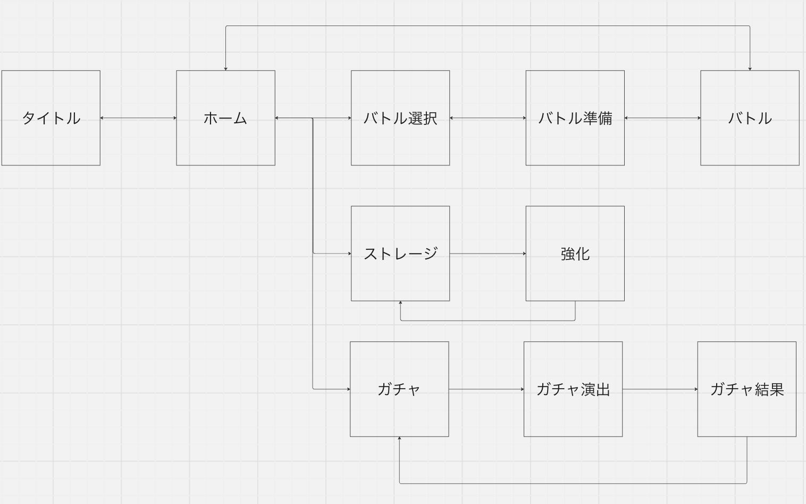

# ページ

ページ遷移

## タイトル (/)
タイトル画面はゲームのタイトルが表示されます。
始めるを押すとホーム画面に遷移します。
ログインを行っていない場合、ユーザ名を入力するためのボックスがあります。

## ホーム (/home)
ホーム画面には、バトル・ストレージ・ガチャのボタンがあります。
それぞれバトル選択、ストレージ、ガチャに遷移します。

## バトル選択 (/battle-select)
バトル選択には、NPCバトル・オンラインバトルの二つのボタンがあります。
それぞれ押すと、バトル準備に遷移します。

## バトル準備 (/battle-prepare)
バトル準備では、使用するキャラクターと装備を選択します。
対戦相手のキャラクターと装備を見ることができます。
準備フェーズの第一段階として、キャラクターを選び、第二段階として、装備を選択することができます。

## バトル (/battle)
バトルでは、カードを用いてじゃんけんを行います。
グーチョキパーを選択できるボタンがあります。
自分または相手の体力が0になると、バトル結果に遷移します。

## バトル結果 (/battle-result)
勝利/敗北を表示
勝った場合は、増加したRP、コイン、ガチャ石を表示します。
ホームへ戻るボタンがあります。

## ストレージ (/strage)
ストレージには持っているキャラクター、装備を表示します。

## 強化 
ストレージ内で、カードを選択すると、強化を行うかどうかのポップアップを表示します。

## ガチャ (/gacha)
ガチャ画面には、ガチャを引く画面があります。

## ガチャ演出 (/gacha-effect)
ガチャの演出を行う画面です。

## ガチャ結果 (/gacha-result)
ガチャで出た結果を表示する画面です。